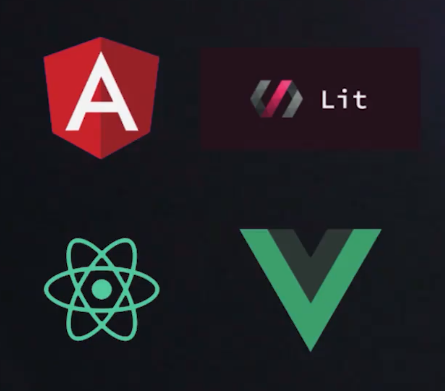

# ¿Por qué JavaScript?
Los tres lenguajes estándares son

HTML para maquetación
CSS para estilos
JS Para interacción

A finales de 2019 la W3C ha decidido subir como un nuevo lenguaje de programación llamado Web Assembly

Pero JavaScript tiene una amplia comunidad de desarrolladores y frameworks que permiten trabajar de forma rápida 

Mobile - React Native 
Escritorio - Electron
Backend - Node.js

Con JS y Node puedes trabajar IoT sin ningún problema