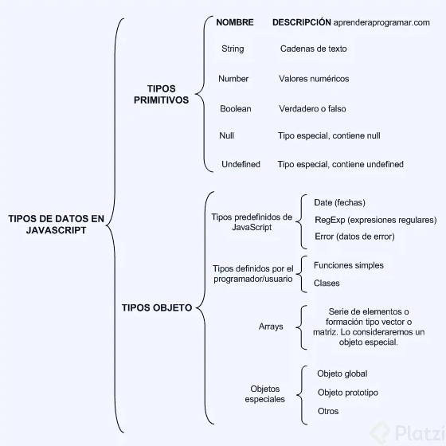

# Elementos de un lenguaje de programación: Variables, Funciones y Sintáxis
Se usará Visual Studio Code actualmetne para poder desarrollar los ejemplos prácticos para poder probar lo que aprendemos

La extensión `.js` es de archivos JavaScript

## Datos que se guarddan en memoria



### Datos primitivos.
Los números se escribirán normalmente

```
40
```

Para el uso de Strings (Cadenas de texto) se envolverán en comillas simples o dobles

```
"Christian Ramírez"
'Christian Ramírez'
```

Para el uso de booleanos, se usará

```
true
false
```

Valores vacíos o empty values, que son valores reservados para un valor faltante, se deberá prevenir en mayor medida el uso de undefined.

```
null
undefined
```

### Datos tipo objeto
Arrays
## Tareas
